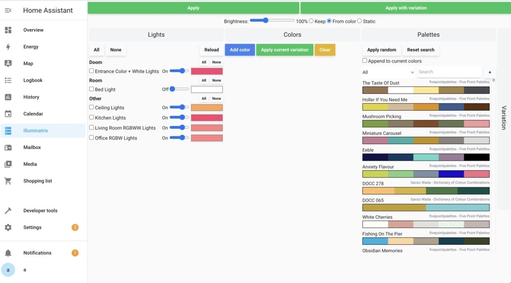

# Illuminatrix

Illuminatrix is a tool for generating fancy color palettes for your smart home's lights.

It features a library of pre-made palettes and a variation engine to modify the colors for infinite variety.

[Home Assistant][ha] is the current target platform, but Illuminatrix could conceivably be used with any
smart home system that supports setting lights' colors (as RGB) and brightnesses.

In Home Assistant, Illuminatrix can work as a Custom Panel, but you can also use it as a standalone app.

## Screenshots

Embedded in Home Assistant:



Also supports dark mode, don't worry.
And yep, it's a bit rough around the edges.

## Installation

Work in progress! Installation into Home Assistant will (hopefully) be made easier in the near-ish future.

For now, you can enable a [custom frontend panel][panel-custom] in your Home Assistant configuration with

```yaml
panel_custom:
  - name: illuminatrix-panel
    url_path: illuminatrix
    sidebar_title: Illuminatrix
    sidebar_icon: mdi:lightbulb
    module_url: /local/illuminatrix/illuminatrix.js
    config: {}
```

and then either:

- download the `dist-lib` artifact of [a recent GitHub Actions CI build][gha-actions]
- build an embeddable build of Illuminatrix into your Home Assistant's `www` directory with
  ```
  env ILLUMINATRIX_OUT_DIR=dist-lib ILLUMINATRIX_LIB=1 pnpm vite build
  ```

and place the resulting bunch of files in `www/illuminatrix` in your Home Assistant's configuration directory,
e.g. `~/.homeassistant/www/illuminatrix`.

Before you ask, no, I have no idea how to do this for Home Assistant OS, since I use a Core installation myself.

## Development

Illuminatrix is written in [Svelte][svelte] and TypeScript, using [Tailwind][tw] for styling.
[Vite][vite] bundles things.

Since the Home Assistant frontend can be a bit tedious to work with, Illuminatrix can be run as a standalone web app
using the Home Assistant REST API. (Areas aren't supported by the API, so you won't see which rooms your lights are in.)

To run Illuminatrix in development mode, you'll need an `.env.development.local` file pointing towards
your Home Assistant instance's API URL and a long-lived access token. For example:

```
VITE_HA_API_URL=http://192.168.1.20:8123/api/
VITE_HA_API_TOKEN=eyThisIsAJWT.eyEyEy.Q46nGblaaahpB0X5nMwmVQLEHk
```

Then, run `pnpm dev` to start the development server and open `http://localhost:5173` in your browser.
With any luck, the Lights panel should get populated by your Home Assistant instance's lights.

### Development as an embedded HA panel

Assuming you have a local HA installation, you can also do e.g.

```
env ILLUMINATRIX_OUT_DIR=../home-assistant-core/conf/www/illuminatrix/ ILLUMINATRIX_LIB=1 pnpm vite build --watch
```

but you may need a couple refreshes of the HA frontend to get the panel to refresh, and YMMV, but I at least
need to have Chrome's dev tools open too (?!).

## License

### Source code

Illuminatrix is licensed under the [MIT License](LICENSE).

### Pre-made palettes

The palette JSON files in `src/api/palettes/data` have been sourced from various places.
The tooling for creating those files is not public at this point.

#### docc.json

Quoting [dblodorn/sanzo-wada](https://github.com/dblodorn/sanzo-wada/):

> 348 color combinations originated by Sanzo Wada (1883-1967) who, in that time of increasingly
> avant-garde and diversified use of color, was quick to focus on the importance of color and
> laid the foundation for contemporary color research. Sanzo Wada was active as an artist,
> art school instructor, costume designer for the movies and the theater,
> and kimono and fashion designer who employed his extensive and versatile talents to do
> innovative work that centered primarily on visual perception and form.

The data in this project is based on the [The Dictionary of Color Combinations][docc] project by Matt DesLauriers,
licensed under the MIT License.

#### lospec.json

This file is based on the [Lospec Palette List](https://lospec.com/palette-list),
downloaded using the [Lospec API](https://lospec.com/palettes/api).

I could not find any particular license information for these palettes,
but they contain attribution in this application, so I hope that's fine for the authors.

#### five_point_palettes.json

This file is based on the work by [Five Point Palettes][fpp] on Tumblr. Not all palettes have been included,
as the Tumblr posts aren't exactly completely machine-readable.

Quoting the FAQ from the Tumblr:

> **Are your palettes free to use?**
>
> Yes!
>
> **Is it okay to use your palettes in art / character design / adoptables?**
>
> Yes! You can use these for anything you want.
>
> **Should I credit you if I use one of your palettes?**
>
> It would be preferable, I really like seeing what people do with these!
> Just @ or tag me in the post, I’d love to have a look!

[panel-custom]: https://developers.home-assistant.io/docs/frontend/custom-ui/creating-custom-panels/
[ha]: https://www.home-assistant.io/
[svelte]: https://svelte.dev/
[docc]: https://github.com/mattdesl/dictionary-of-colour-combinations
[fpp]: https://fivepointpalettes.tumblr.com/
[tw]: https://tailwindcss.com/
[vite]: https://vitejs.dev/
[gha-actions]: https://github.com/akx/illuminatrix/actions
